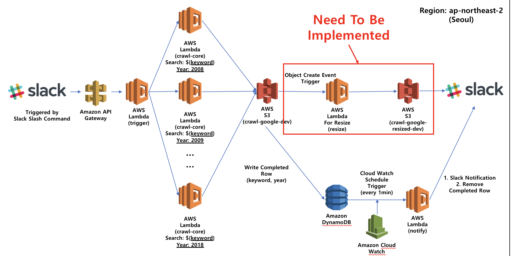
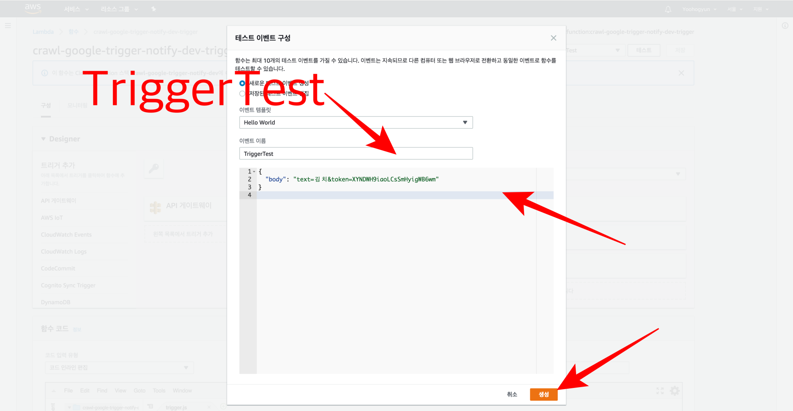
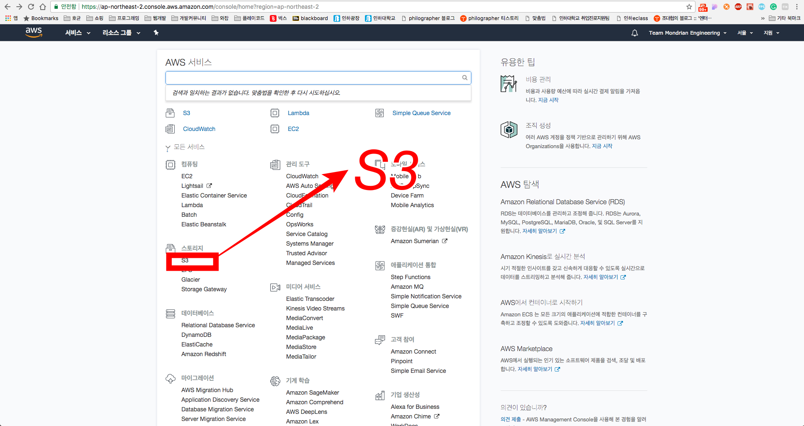
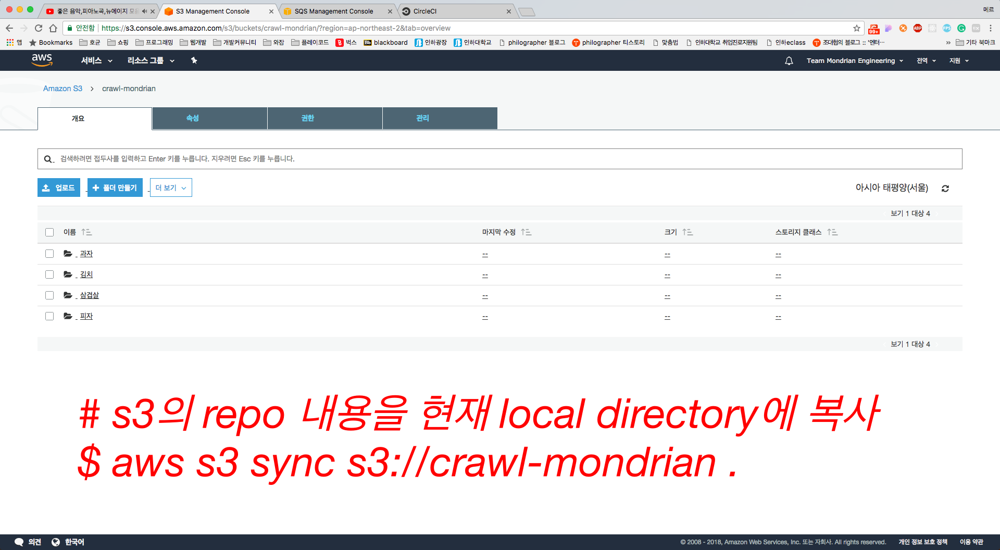
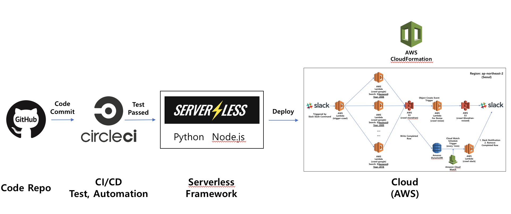

## Implemented Architecture Overview
Our Team Need to Image Crawling service for image learning.

So I Designed crawling micro service architecture like this.
1. user manually run Lambda Function named `trigger-crawl`
2. `trigger-crawl` function trigger  multiple `crawl-google` function `crawl-google` called multiple times with different arguments
3. `crawl-google` function crawl images from google, and then upload images to `crawl-mondrian` s3 bucket
4. If `crawl-google` function ended then send message to `crawl-queue` SQS. 
5. Every 1 minute, Cloud watch event rule automatically triggered by reservation. 
6. The Cloud watch trigger to run `crawl-slack` lambda function.
7. `crawl-slack` lambda function check if `crawl-queue`  has same 11 keyword (2008 ~ 2018, 11years).
8. If `crawl-queue`  has same 11 keyword then `crawl-slack` remove keyword from `crawl-queue` then web hook to send slack message.



## How To Use
- **Clone Github Repo**
```bash
$ git clone https://github.com/philographer/crawl-google.git
```

- **Install Serverless Framework**
```bash
# Installing the serverless cli
$ npm install -g serverless
```

- **Set-up your Provider Credentials.** [Watch the video on setting up credentials](https://www.youtube.com/watch?v=HSd9uYj2LJA)

- **Deploy your Code**
```bash
$ cd crawl-google
$ npm run deploy # same with 
```

- **Click `Lambda` on AWS Console**

- **`crawl-google-trigger-notify-dev-trigger` Click**


- **`테스트 이벤트 구성` Click**


- **Test Event name is `TriggerTest` and Insert Text like below. And Click `생성`**
```json
{
"body": "text=김치&token=XYNDWH9iaoLCsSmHyigWB6wm"
}
```


- **Then Select `TriggerTest` And Click `테스트`**


- **Wait a 5minutes Then, Click `S3` on AWS Console**


- **Then, Click `crawl-mondrian-dev` Bucket**


- **You can see crawled image.**


- **You can sync Bucket with local directory**
```bash
## ref1.  https://docs.aws.amazon.com/cli/latest/reference/s3/sync.html
## ref2. https://docs.aws.amazon.com/ko_kr/cli/latest/userguide/installing.html

# AWS Cli Install
$ pip install awscli --upgrade --user

# s3의 Bucket을 현재 local directory에 다운로드
$ aws s3 sync s3://crawl-mondrian .

# 현재 local directory의 내용을 Bucket으로 업로드 (없는 내용은 지움, local에서 삭제한 이미지는 Bucket에서도 삭제)
$ aws s3 sync . s3://crawl-mondrian --delete
```

## Grand Goal Architecture


## Source reference
- [Serverless - The Serverless Application Framework powered by AWS Lambda, API Gateway, and more](https://serverless.com/)
- [Continuous Integration and Delivery - CircleCI](https://circleci.com/)
- [Amazon Web Services](https://aws.amazon.com/ko/)
- [Webhooks | GitHub Developer Guide](https://developer.github.com/webhooks/)
- [Incoming Webhooks | Slack](https://api.slack.com/incoming-webhooks)
